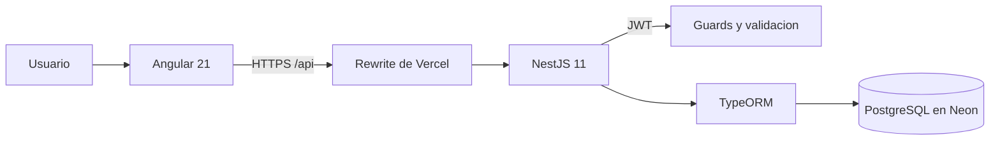

<p align="center">
  
</p>

<h1 align="center">PULSO</h1>

<p align="center">
  <strong>Gestion de proyectos simple, visual y accionable.</strong><br />
  Trabajo Final Integrador - Desarrollo de Aplicaciones Web - 2026
</p>

<p align="center">
  <a href="https://pulso-grupo-am.vercel.app"><strong>Ver aplicacion</strong></a>
</p>

## El proyecto

PULSO es una aplicacion web para centralizar la gestion de proyectos, clientes y tareas de una consultora. La propuesta prioriza una operacion clara: permite conocer el estado del trabajo, encontrar informacion con rapidez y actualizar el avance desde una interfaz unica.

El sistema fue desarrollado como Trabajo Final Integrador de la Tecnicatura Universitaria en Desarrollo Web. Implementa los requerimientos funcionales de la catedra y suma cuatro expansiones orientadas a mejorar la consulta, el seguimiento y la toma de decisiones.

## Funcionalidades

- autenticacion de usuarios mediante JWT;
- alta y modificacion de proyectos, con cliente opcional;
- alta y modificacion de clientes, respetando sus reglas de estado;
- gestion de tareas asociadas a cada proyecto;
- estados controlados para proyectos, clientes y tareas;
- interfaz responsive con identidad visual propia;
- API REST versionada y validacion de datos de entrada.

## Expansiones del TPI

| Expansion | Implementacion |
| --- | --- |
| Busqueda avanzada | Busqueda por nombre, filtro por estado, ordenamiento configurable y paginacion desde el backend. |
| Exportacion de datos | Descarga de los proyectos visibles en formato CSV. |
| Estadisticas | Indicadores de proyectos y resumen de tareas por estado, con porcentaje de avance. |
| Panel visual de tareas | Tablero Kanban con columnas por estado, tarjetas, busqueda y cambio rapido de situacion. |

Estas cuatro funcionalidades cubren el requisito de incorporar al menos una expansion por integrante del equipo.

## Arquitectura



El despliegue activo utiliza proyectos independientes de Vercel para frontend y backend, con PostgreSQL alojado en Neon. El repositorio tambien incluye una alternativa tradicional: nginx sirve Angular y redirige `/api` a NestJS, mientras PM2 mantiene el proceso del backend disponible. Las credenciales y los secretos de produccion se administran como variables de entorno y no forman parte del repositorio.

## Tecnologias

| Capa | Tecnologias |
| --- | --- |
| Frontend | Angular 21, TypeScript, PrimeNG, Signals, Reactive Forms |
| Backend | NestJS 11, TypeScript, JWT, class-validator |
| Persistencia | PostgreSQL, TypeORM, Neon |
| Entrega | Vercel, nginx, PM2, GitHub |

## Estructura

```text
integradorDaw/
├── frontend/       Aplicacion Angular e interfaz PULSO
├── backend/        API REST, autenticacion y reglas de negocio
├── deploy/         Configuracion de nginx
├── scripts/        Utilidades para migracion de base de datos
├── docs/           Guia de despliegue con nginx y PM2
└── package.json    Comandos generales del monorepo
```

## Puesta en marcha local

### Requisitos

- Node.js 20 o superior;
- npm;
- PostgreSQL 14 o superior.

### Instalacion

```bash
git clone https://github.com/Fernanbits/integrador-daw.git
cd integrador-daw
npm install
npm run install:all
```

Crear `backend/.env` a partir de [`backend/.env.example`](backend/.env.example) y completar los datos de la base local y `JWT_SECRET`.

```bash
npm run dev
```

La aplicacion queda disponible en `http://localhost:4200` y la API en `http://localhost:3000/api/v1`.

Para generar ambos builds de produccion:

```bash
npm run build
```

La instalacion tradicional se detalla en la [guia de despliegue con nginx y PM2](docs/despliegue-nginx-pm2.md).

## Equipo

| Integrante |
| --- |
| Gustavo Minchiotti |
| Alicia Viviana Montenegro |
| Francisco López |
| María Jimena Fernández |

## Estado del proyecto

- Frontend publicado: [pulso-grupo-am.vercel.app](https://pulso-grupo-am.vercel.app)
- Backend publicado: [pulso-api-grupo-am.vercel.app](https://pulso-api-grupo-am.vercel.app)
- Base de datos migrada y validada en Neon

> Las credenciales de demostracion se entregan por un canal separado. El repositorio no contiene contrasenas, tokens ni copias de la base de datos.
